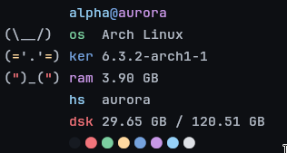

# Cutefetch

Cutefetch is a little fetch utility completely made in the C programming language
which aims to be simple and to show a little cute bunny in your terminal as well as
relevant information about your current running system.



## Features

- Header
- Bunny banner
- Os name
- Kernel version
- Current used ram (Todo: Show the total ram)
- Hostname
- Disk: Used disk space / Total disk space
- Color palette

## Requirements

- gcc
- gnumake
- git
- sudo
- uname (you should have it already installed)
- your hostname at /etc/hostname (you may already have that file there)
- A nerd font (to correctly render the glyphs at the color palette)

## Installation

In an arch system you can build it by using your preferred aur helper such as yay per example

```sh
yay -S cutefetch
```

> Another package managers are still WIP, contributions 4 packaging and others are welcome aswell :)

## Manual building

Run a little list of shell script commands.

```sh
mkdir -pv ~/repo && cd ~/repo
git clone https://github.com/AlphaTechnolog/cutefetch.git && cd cutefetch
sudo make install
```

Then just run in your terminal `cutefetch`, and you'll see the cute bunny appearing
in your terminal screen :)

## Compilation tricks

You can also set a prefix on where you wanna install cutefetch.

```sh
sudo make PREFIX=/usr/local install
sudo make PREFIX=/usr/local uninstall
```

## Dev notes

- Cleaning up the file tree

```sh
make clean
```

> if you already have run `sudo make install` without having the program compiled you may have to run

```sh
sudo make clean
```

- Fresh compilation

```sh
make clean all
```

## Enjoy

Thanks for reading me! Enjoy with cutefetch, also if you liked this little project
please give me a star on this repo, that will support me and my work at GitHub :)
