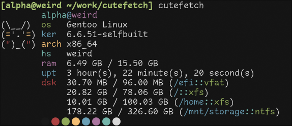

# Cutefetch

Cutefetch is a little fetch utility completely made in the C programming language
which aims to be simple and to show a little cute bunny in your terminal as well as
relevant information about your current running system.



## Features

- Header
- Bunny banner
- Os name
- Kernel version
- CPU Arch
- Hostname
- Used ram
- Uptime
- Disk: Used disk space / Total disk space (Shows mountpoints)
- Color palette squares

## Requirements

- A working c compiler, cutefetch is c89 compliant so it could probably build in most c compilers out there.
- An implementation of make, either it's gnumake or bsd make, etc.
- A nerd font (to correctly render the glyphs at the color palette)
- On debian you'll probably need to install the pkg `libbsd-dev` since we rely on `strlcpy`

## Installation

### Arch Linux

In an arch system you can build it by using your preferred aur helper such as yay per example

```sh
yay -S cutefetch
```

### NixOS

This repository provides a nix flake which allows you to use cutefetch with nix easily. Try it out by going ahead to your terminal and type:

```sh
nix run github:AlphaTechnolog/cutefetch
```

Take as reference the next dev shell which provides a cutefetch installation, you could put the cutefetch pkg in your environment.systemPackages or home.pkgs to install system wide if you want to do so.

```nix
{
  inputs = {
    nixpkgs.url = "github:nixos/nixpkgs";
    flake-utils.url = "github:numtide/flake-utils";
    cutefetch.url = "github:AlphaTechnolog/cutefetch";
  };

  outputs = { self, nixpkgs, flake-utils, ... } @inputs: flake-utils.lib.eachDefaultSystem(system: let
    pkgs = import nixpkgs rec {
      inherit system;
      overlays = [inputs.cutefetch.overlays.${system}.default];
    };
  in (with pkgs; {
    devShells.default = mkShell {
      buildInputs = [cutefetch];
    };
  }));
}
```

Then if you execute `nix develop` in the folder where that `flake.nix` file is, you will
get a shell where you can execute `cutefetch`.

So, if you're using NixOS, import the cutefetch flake in your inputs, make an overlay,
just like in the example, and then use home.packages if you're using home manager
or environment.systemPackages for system wide install to make cutefetch available in your
system.

### Gentoo Linux

When running gentoo, you could use the [Alxhr0's](https://github.com/Alxhr0) andromeda repository which includes an
ebuild for cutefetch, check it out [here](https://gitlab.com/Alxhr0/andromeda).

Include the repository by following the next commands:

```sh
emerge -av app-eselect/eselect-repository
eselect repository add andromeda git https://gitlab.com/Alxhr0/andromeda.git
emerge --sync andromeda
```

And now you can install it by unmasking it and accepting the license:

```sh
echo 'app-misc/cutefetch **' >> /etc/portage/package.accept_keywords/cutefetch
echo 'app-misc/cutefetch all-rights-reserved' >> /etc/portage/package.license/cutefetch
emerge -av app-misc/cutefetch
```

### Others package managers

We're searching for contributors for packaging cutefetch on others distros, if you like cutefetch
but it's not available in your distro, you could try packaging it for it, or adding a suggestion in the issues tab ;)

Else, you can try manually building it, it's easy :)

## Manual building

Run a little list of shell script commands.

```sh
mkdir -pv ~/repo && cd ~/repo
git clone https://github.com/AlphaTechnolog/cutefetch.git && cd cutefetch
make
sudo make install
```

Then just run in your terminal `cutefetch`, and you should see the proper cutefetch output.

## Compilation tricks

You may want to build it using another compiler, you can do it by overriding the
`CC` variable:

```sh
make CC=tcc
sudo make install
```

You can also specify where the cutefetch binary will be installed and at which prefix by overriding the DESTDIR and the PREFIX vars.

```sh
mkdir ~/rootfs
make DESTDIR=~/rootfs PREFIX=/customprefix install
```

That will generate something like this:

```
/home/alpha/rootfs/
└── customprefix
    └── bin
        └── cutefetch

3 directories, 1 file
```

The default values for these variables are:

- `DESTDIR`: `/` so it gets installed at the root dir.
- `PREFIX`: `/usr` so it gets installed at /usr/bin.

## Dev notes

- Cleaning the file tree

```sh
make clean
```

## Thanks to

- [Alxhr0](https://github.com/Alxhr0): Who've built & tested cutefetch on others distros and packaged it for gentoo.

## Enjoy

Thanks for reading me! Enjoy with cutefetch, also if you liked this little project
please give me a star on this repo, that will support me and my work at GitHub :)
